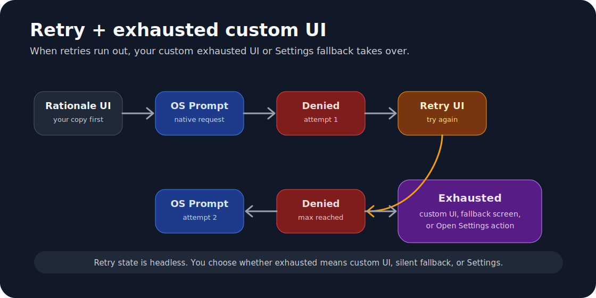
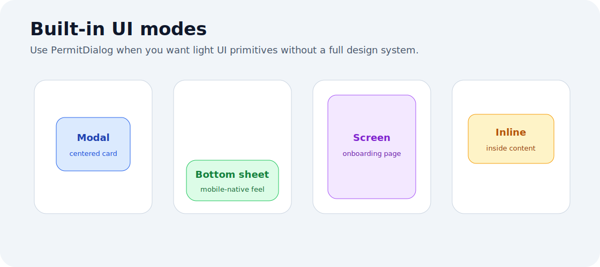

<p align="center">
  
</p>

<h1 align="center">react-native-permit</h1>

<p align="center">
  Permission hooks, retries, onboarding flows, modals, bottom sheets, screen UI,
  steppers, analytics, persistence, and Jest mocks for React Native.
</p>

[](https://www.npmjs.com/package/react-native-permit)
[](https://www.npmjs.com/package/react-native-permit)
[](./LICENSE)
[](https://www.typescriptlang.org/)
[](https://reactnative.dev/)
[](#package-size)
[](https://www.npmjs.com/package/react-native-permissions)
[](https://expo.dev/)
[](#testing)

Small permission orchestration for React Native, built on top of
[`react-native-permissions`](https://www.npmjs.com/package/react-native-permissions).

> Permission prompts are tiny. Permission flows are not.

`react-native-permit` gives you the pieces most apps build repeatedly:
permission checks, request retries, persisted exhaustion, foreground re-checks,
custom permission onboarding, a stepper, lightweight modal/bottom-sheet/screen
UI, analytics events, storage hooks, and Jest-friendly mocks.

```tsx
import { Permit, PermitDialog, usePermit, usePermitSequence } from 'react-native-permit';
```

> Ship the feature, not another permission state machine.

## Why use this package?

Use `react-native-permit` when you need more than a raw native permission
request. It is designed for apps that need permission rationale screens,
permission modals, bottom sheets, full-screen permission flows, onboarding
steppers, retry logic, blocked-permission handling, settings redirects,
permission hooks, analytics events, and test mocks.

Common searches this package is intended to answer:

| Search/use case | API |
| --- | --- |
| React Native permission hook | `usePermit` |
| React Native multiple permissions hook | `usePermits` |
| React Native permission modal | `PermitDialog presentation="modal"` |
| React Native permission bottom sheet | `PermitDialog presentation="bottom-sheet"` |
| React Native permission screen | `PermitDialog presentation="screen"` |
| React Native permission onboarding | `usePermitSequence` |
| React Native permission stepper | `PermitStepper` |
| React Native camera permission UI | `Permit.request('camera')` + `PermitDialog` |
| React Native location permission retry | `Permit.request('location', { retry })` |
| React Native notification permission helper | `Permit.request('notifications', { notifications })` |
| React Native permission Jest mock | `react-native-permit/testing` |

## What problem does it solve?

Raw permission packages answer one question: "Can I ask the OS for this
permission?" Production apps usually need more.

| App need | Why it matters | Supported here |
| --- | --- | --- |
| Check before asking | Avoids unnecessary prompts | Yes |
| Rationale UI | Explains why the app needs access | Yes |
| Retry flow | Handles first denial without rebuilding state | Yes |
| Blocked state | Sends users to Settings when prompts stop working | Yes |
| Persisted exhaustion | Stops repeated prompts across sessions | Yes |
| Multi-step onboarding | Handles camera + mic + notifications flows | Yes |
| Custom UI | Lets your design system own the experience | Yes |
| Built-in UI | Gives quick modal/sheet/screen defaults | Yes |
| Analytics | Tracks prompt, denial, blocked, and exhausted events | Yes |
| Testing | Avoids real OS prompts in Jest | Yes |

> The OS gives you a prompt. Your product needs a flow.

<p align="center">
  
</p>

## Comparison

| Capability | `react-native-permissions` | Manual app code | `react-native-permit` |
| --- | --- | --- | --- |
| Native permission access | Yes | No | Uses peer dependency |
| Typed result normalization | Yes | You write it | Yes |
| Retry attempts | No | You write it | Yes |
| Persisted exhaustion | No | You write it | Yes |
| AppState re-check hook | No | You write it | Yes |
| Multi-permission hook | Low-level only | You write it | Yes |
| Custom onboarding state machine | No | You write it | Yes |
| Built-in modal/bottom-sheet/screen UI | No | You write it | Yes |
| Stepper UI | No | You write it | Yes |
| Analytics event stream | No | You write it | Yes |
| Jest permission mock | No | You write it | Yes |

Use both packages together: `react-native-permissions` for native access,
`react-native-permit` for the product flow around it.

## Discoverability map

This package is intentionally documented around the phrases developers usually
search for when building permission UX in React Native.

| If you search for... | The package provides... |
| --- | --- |
| `react native permissions hook` | `usePermit`, `usePermits`, `usePermitListener` |
| `react native permission modal` | `PermitDialog presentation="modal"` |
| `react native permission bottom sheet` | `PermitDialog presentation="bottom-sheet"` |
| `react native permission screen` | `PermitDialog presentation="screen"` |
| `react native permission onboarding` | `usePermitSequence` |
| `react native multiple permissions` | `usePermits`, `usePermitSequence` |
| `react native camera permission ui` | `Permit.request('camera')`, `PermitDialog` |
| `react native location permission retry` | `Permit.request('location', { retry })` |
| `react native notification permission helper` | `NotificationOptions` |
| `react native permission testing` | `react-native-permit/testing` |

## Use cases

| Product use case | Permissions | Recommended API |
| --- | --- | --- |
| QR scanner | `camera` | `usePermit`, `PermitDialog` |
| Video recorder | `camera`, `microphone` | `usePermits`, `PermitDialog` |
| Voice notes | `microphone` | `usePermit` |
| Nearby stores | `location` | `Permit.request` with retry |
| Delivery tracking | `location`, `location-always` | `usePermitSequence` |
| Order updates | `notifications` | `NotificationOptions` |
| Media upload | `photo-library` | `usePermit` |
| Avatar picker | `photo-library` | `PermitDialog presentation="inline"` |
| Device pairing | `bluetooth` | `Permit.request('bluetooth')` |
| First-run setup | multiple permissions | `usePermitSequence`, `PermitStepper` |
| Hard-blocked feature | any required permission | `Permit.openSettings` |
| Permission-gated tests | any permission | `react-native-permit/testing` |

## Features

| Feature | Included |
| --- | --- |
| Native permission checks and requests | Via `react-native-permissions` peer dependency |
| Small JavaScript orchestration layer | Yes |
| TypeScript declarations | Yes |
| Single permission hook | `usePermit` |
| Multiple permission hook | `usePermits` |
| Permission status listener | `usePermitListener` |
| Custom multi-step permission flow | `usePermitSequence` |
| Built-in UI | `PermitDialog` |
| Stepper UI | `PermitStepper` |
| Presentations | `bottom-sheet`, `modal`, `screen`, `inline` |
| Retry and exhaustion handling | Yes |
| Persisted exhaustion | Storage adapter |
| Analytics events | `Permit.configure({ onEvent })` |
| Testing utilities | `react-native-permit/testing` |
| Native code in this package | No |

## Contents

- [Features](#features)
- [Why use this package?](#why-use-this-package)
- [What problem does it solve?](#what-problem-does-it-solve)
- [Comparison](#comparison)
- [Discoverability map](#discoverability-map)
- [Use cases](#use-cases)
- [Installation](#installation)
- [Why react-native-permissions is required](#why-react-native-permissions-is-required)
- [Supported platforms](#supported-platforms)
- [Supported React Native versions](#supported-react-native-versions)
- [Supported permission keys](#supported-permission-keys)
- [Exports](#exports)
- [Quick start](#quick-start)
- [Result values](#result-values)
- [API reference](#api-reference)
- [Hooks](#hooks)
- [Custom permission sequences](#custom-permission-sequences)
- [Built-in UI](#built-in-ui)
- [Analytics and storage](#analytics-and-storage)
- [Testing](#testing)
- [Package size](#package-size)
- [Examples](#examples)

## Installation

### Bare React Native

```bash
npm install react-native-permit react-native-permissions
```

or:

```bash
yarn add react-native-permit react-native-permissions
```

Install pods after adding dependencies:

```bash
cd ios && pod install
```

### Expo

```bash
npx expo install react-native-permissions
npm install react-native-permit
```

Expo support depends on your `react-native-permissions` setup and config plugin
configuration. `react-native-permit` itself does not add native modules.

### iOS

Add only the `Info.plist` usage descriptions for permissions your app actually
uses.

```xml
<key>NSCameraUsageDescription</key>
<string>Camera access is used to scan QR codes.</string>

<key>NSMicrophoneUsageDescription</key>
<string>Microphone access is used to record audio.</string>

<key>NSLocationWhenInUseUsageDescription</key>
<string>Location access is used to show nearby results.</string>

<key>NSPhotoLibraryUsageDescription</key>
<string>Photo access is used to attach images.</string>

<key>NSUserNotificationsUsageDescription</key>
<string>Notifications are used for reminders and updates.</string>
```

### Android

Add only the manifest entries for permissions your app actually uses.

```xml
<uses-permission android:name="android.permission.CAMERA" />
<uses-permission android:name="android.permission.RECORD_AUDIO" />
<uses-permission android:name="android.permission.ACCESS_FINE_LOCATION" />
<uses-permission android:name="android.permission.ACCESS_COARSE_LOCATION" />
<uses-permission android:name="android.permission.POST_NOTIFICATIONS" />
<uses-permission android:name="android.permission.READ_MEDIA_IMAGES" />
```

`react-native-permit` is JavaScript/TypeScript only. Follow the native setup
from `react-native-permissions` for iOS pods, Android manifest entries, and
permission-specific platform configuration.

## Why react-native-permissions is required

| Package | Responsibility |
| --- | --- |
| `react-native-permissions` | Native permission constants, native `check`, native `request`, notification APIs, and `openSettings` |
| `react-native-permit` | Request orchestration, retries, persistence, hooks, sequence state, small UI helpers, event hooks, and tests |

Keeping native permission work in `react-native-permissions` keeps this package
small and avoids shipping duplicate iOS/Android native code.

## Supported platforms

| Platform | Support | Notes |
| --- | --- | --- |
| iOS | Yes | Native support comes from `react-native-permissions` |
| Android | Yes | API-level behavior is delegated to `react-native-permissions` |
| Expo managed | Yes | Use Expo-compatible `react-native-permissions` setup |
| Web | No native prompts | You can still use mock/testing utilities |

## Supported React Native versions

| `react-native-permit` version | React Native version | React |
| --- | --- | --- |
| `0.1.x` | `>=0.72` | `>=18` |

The package is architecture-neutral because it does not include native code.
Native compatibility follows the installed `react-native-permissions` version.

## Supported permission keys

| Permission key | iOS | Android | Notes |
| --- | --- | --- | --- |
| `camera` | Yes | Yes | Camera prompt |
| `microphone` | Yes | Yes | Audio recording prompt |
| `location` | Yes | Yes | When-in-use/fine location |
| `location-coarse` | No | Yes | Android coarse location |
| `location-always` | Yes | Yes | Resolves multiple native permissions where needed |
| `notifications` | Yes | Yes | Android runtime prompt is API 33+ |
| `photo-library` | Yes | Yes | iOS can return `limited` |
| `photo-library-add` | Yes | No | iOS add-only photo access |
| `contacts` | Yes | Yes | Contacts prompt |
| `calendar` | Yes | Yes | Calendar prompt |
| `reminders` | Yes | No | iOS reminders |
| `bluetooth` | Yes | Yes | Android maps to scan/connect where available |
| `motion` | Yes | Yes | Android maps to activity recognition |
| `face-id` | Yes | No | iOS Face ID |
| `tracking` | Yes | No | iOS app tracking transparency |
| `speech-recognition` | Yes | No | iOS speech recognition |
| `body-sensors` | No | Yes | Android body sensors |
| `activity-recognition` | No | Yes | Android activity recognition |
| `nearby-wifi-devices` | No | Yes | Android 13+ with fallback |
| `media-location` | No | Yes | Android media location |

## Exports

| Export | Type | Description |
| --- | --- | --- |
| `Permit` | Object | Core check/request/settings/config API |
| `usePermit` | Hook | Single-permission hook |
| `usePermits` | Hook | Multi-permission hook |
| `usePermitListener` | Hook | Status listener hook |
| `usePermitSequence` | Hook | Headless multi-step permission sequence |
| `PermitDialog` | Component | Built-in modal, bottom-sheet, screen, and inline UI |
| `PermitStepper` | Component | Dots, bar, or numbers step indicator |
| `PermitAbortController` | Class | Cancels an in-flight request |
| `PermitAbortSignal` | Class | Abort signal used by request options |
| `react-native-permit/testing` | Subpath | Jest/test helper exports |

## Quick start

```tsx
import { Permit } from 'react-native-permit';

const result = await Permit.request('camera');

if (result === 'granted') {
  // Continue with the feature.
}
```

With retry and persisted exhaustion:

```tsx
await Permit.request('location', {
  retry: {
    maxAttempts: 3,
    persistExhaustion: true,
    resetExhaustionAfterDays: 30,
  },
});
```

## How can I take advantage of this?

There are three intended usage levels.

| Level | Use this | When |
| --- | --- | --- |
| Headless API | `Permit.check`, `Permit.request` | You already have screens/modals and only need permission state |
| Hooks/custom UI | `usePermit`, `usePermitSequence` | You want your own UI and flows |
| Built-in UI | `PermitDialog`, `PermitStepper` | You want small ready-made UI primitives |

### Headless request

```tsx
const result = await Permit.request('camera');
```

### Custom UI request

```tsx
const camera = usePermit('camera');

return (
  <Button
    title="Allow camera"
    onPress={() => camera.request({ retry: { maxAttempts: 2 } })}
  />
);
```

### Built-in UI request

```tsx
<PermitDialog
  presentation="modal"
  title="Camera access"
  message="Camera access is used to scan QR codes."
  onPrimary={() => Permit.request('camera')}
/>;
```

## Result values

| Result | Meaning |
| --- | --- |
| `granted` | Permission is fully granted |
| `limited` | iOS photo library limited access |
| `provisional` | iOS provisional notification authorization |
| `denied` | User denied, but the permission may be requested again |
| `blocked` | System prompt will not show again until settings change |
| `skipped` | User skipped your custom UI flow |
| `exhausted` | Retry limit was reached |
| `unavailable` | Permission is not available on this device/platform |
| `cancelled` | Request was aborted before completion |

## API reference

### `Permit`

| Method | Signature | Description |
| --- | --- | --- |
| `Permit.check` | `(permission, options?) => Promise<PermitStatus>` | Checks one permission without showing a system prompt |
| `Permit.checkAll` | `(permissions) => Promise<Record<PermissionKey, PermitStatus>>` | Checks multiple permissions |
| `Permit.request` | `(permission, options?) => Promise<PermitResult>` | Requests one permission with retry/exhaustion support |
| `Permit.openSettings` | `(permission?) => Promise<void>` | Opens app settings |
| `Permit.clearExhaustion` | `(permission, retry?) => Promise<void>` | Clears persisted exhaustion for a permission |
| `Permit.configure` | `({ storage?, onEvent? }) => () => void` | Configures storage and event listener |
| `Permit.subscribe` | `(permission, listener) => () => void` | Subscribes to status changes |

### Type summary

```ts
type PermissionKey =
  | 'camera'
  | 'microphone'
  | 'location'
  | 'location-coarse'
  | 'location-always'
  | 'notifications'
  | 'photo-library'
  | 'photo-library-add'
  | 'contacts'
  | 'calendar'
  | 'reminders'
  | 'bluetooth'
  | 'motion'
  | 'face-id'
  | 'tracking'
  | 'speech-recognition'
  | 'body-sensors'
  | 'activity-recognition'
  | 'nearby-wifi-devices'
  | 'media-location';
```

```ts
type PermitStatus =
  | 'granted'
  | 'limited'
  | 'provisional'
  | 'denied'
  | 'blocked'
  | 'unavailable'
  | 'unknown';
```

```ts
type PermitResult =
  | PermitStatus
  | 'skipped'
  | 'exhausted'
  | 'cancelled';
```

### `Permit.request` options

| Prop | Type | Default | Description |
| --- | --- | --- | --- |
| `retry` | `RetryConfig` | `undefined` | Retry and exhaustion behavior |
| `notifications` | `NotificationOptions` | `undefined` | Notification-specific request options |
| `signal` | `PermitAbortSignal` | `undefined` | Cancels an in-flight request |
| `onGranted` | `() => void` | `undefined` | Called when result is `granted` |
| `onDenied` | `() => void` | `undefined` | Called when result is `denied` |
| `onBlocked` | `() => void` | `undefined` | Called when result is `blocked` |
| `onSkipped` | `() => void` | `undefined` | Reserved for custom UI flows |
| `onExhausted` | `() => void` | `undefined` | Called when retry attempts are exhausted |

### `Permit.check` options

| Prop | Type | Default | Description |
| --- | --- | --- | --- |
| `notifications` | `NotificationOptions` | `undefined` | Used when checking notification-specific status |

### `Permit.configure` options

| Prop | Type | Default | Description |
| --- | --- | --- | --- |
| `storage` | `PermitStorage` | In-memory storage | Storage adapter used for persisted exhaustion |
| `onEvent` | `(event: PermitEvent) => void` | `undefined` | Analytics/event listener |

### `RetryConfig`

<p align="center">
  
</p>

| Prop | Type | Default | Description |
| --- | --- | --- | --- |
| `maxAttempts` | `number` | `1` | Total request attempts |
| `persistExhaustion` | `boolean` | `false` | Stores exhausted state across sessions |
| `resetExhaustionAfterDays` | `number` | `undefined` | Automatically clears stored exhaustion after N days |
| `persistenceKey` | `string` | `@permit/exhausted/` | Storage key prefix |
| `cooldownMs` | `number` | `0` | Delay between attempts |
| `onAttempt` | `(attempt, maxAttempts) => void` | `undefined` | Called before each attempt |
| `onRetriesExhausted` | `(permission) => void` | `undefined` | Called once when attempts are exhausted |

### `NotificationOptions`

| Prop | Type | Default | Description |
| --- | --- | --- | --- |
| `alert` | `boolean` | `true` | Request alert notifications |
| `badge` | `boolean` | `true` | Request badge notifications |
| `sound` | `boolean` | `true` | Request sound notifications |
| `provisional` | `boolean` | `false` | Request provisional iOS authorization |
| `criticalAlert` | `boolean` | `false` | iOS critical alerts, requires entitlement |
| `announcement` | `boolean` | `false` | iOS announcement notifications |
| `carPlay` | `boolean` | `false` | iOS CarPlay notifications |

## Hooks

### `usePermit`

```tsx
const camera = usePermit('camera');
```

Options:

| Prop | Type | Default | Description |
| --- | --- | --- | --- |
| `recheckOnForeground` | `boolean` | `true` | Re-check when app returns to active state |
| `recheckOnMount` | `boolean` | `true` | Check when the hook mounts |

Return value:

| Field | Type | Description |
| --- | --- | --- |
| `status` | `PermitStatus` | Current known status |
| `result` | `PermitResult \| null` | Last request result |
| `isGranted` | `boolean` | `status === 'granted'` |
| `isLimited` | `boolean` | `status === 'limited'` |
| `isProvisional` | `boolean` | `status === 'provisional'` |
| `isBlocked` | `boolean` | `status === 'blocked'` |
| `isExhausted` | `boolean` | Last result was `exhausted` |
| `isUnavailable` | `boolean` | `status === 'unavailable'` |
| `request` | `(options?) => Promise<PermitResult>` | Requests the permission |
| `check` | `() => Promise<PermitStatus>` | Re-checks the permission |
| `openSettings` | `() => Promise<void>` | Opens settings |
| `clearExhaustion` | `() => Promise<void>` | Clears persisted exhaustion |

### `usePermits`

```tsx
const recording = usePermits(['camera', 'microphone']);
```

| Field | Type | Description |
| --- | --- | --- |
| `statuses` | `Record<PermissionKey, PermitStatus>` | Permission status map |
| `allGranted` | `boolean` | Every permission is granted |
| `someGranted` | `boolean` | At least one permission is granted |
| `check` | `() => Promise<Record<PermissionKey, PermitStatus>>` | Refresh statuses |

### `usePermitListener`

```tsx
usePermitListener('location', (status) => {
  console.log(status);
});
```

| Option | Type | Default | Description |
| --- | --- | --- | --- |
| `fireImmediately` | `boolean` | `false` | Calls the listener with the current status on mount |

## Custom permission sequences

Use `usePermitSequence` when you want full control over UI while using the
library's sequence state.

<p align="center">
  
</p>

```tsx
const sequence = usePermitSequence(steps, {
  onComplete: (results) => console.log(results),
});
```

### `PermitStep`

| Prop | Type | Required | Description |
| --- | --- | --- | --- |
| `permission` | `PermissionKey` | Yes | Permission to request |
| `rationale` | `RationaleConfig` | Yes | Text used by your UI |
| `optional` | `boolean` | No | Allows skipping the step |
| `skipIfGranted` | `boolean` | No | Skips step when permission is already granted. Default: `true` |
| `retry` | `RetryConfig` | No | Retry behavior for this step |
| `notifications` | `NotificationOptions` | No | Notification request options |

### `RationaleConfig`

| Prop | Type | Required | Description |
| --- | --- | --- | --- |
| `title` | `string` | Yes | Main title |
| `message` | `string` | Yes | Supporting text |
| `continueLabel` | `string` | No | Primary button label |
| `skipLabel` | `string` | No | Secondary button label |
| `accentColor` | `string` | No | Suggested UI accent |

### `usePermitSequence` options

| Prop | Type | Description |
| --- | --- | --- |
| `onComplete` | `(results) => void` | Called when all steps finish |
| `onRequiredDenied` | `(permission, results) => void` | Called when a required permission reaches a denied/exhausted state |
| `onAbandon` | `(permission, results) => void` | Called when `cancel` is used |

### `usePermitSequence` return value

| Field | Type | Description |
| --- | --- | --- |
| `stepIndex` | `number` | Current zero-based step index |
| `totalSteps` | `number` | Number of configured steps |
| `visibleStepIndex` | `number` | Index among visible/non-skipped steps |
| `visibleTotalSteps` | `number` | Number of visible/non-skipped steps |
| `currentStep` | `PermitStep \| null` | Current step config |
| `currentPermission` | `PermissionKey \| null` | Current permission |
| `attempt` | `number` | Current attempt number |
| `maxAttempts` | `number` | Max attempts for current step |
| `state` | `PermitSequenceState` | Current sequence state |
| `results` | `Partial<Record<PermissionKey, PermitResult>>` | Results collected so far |
| `start` | `() => void` | Starts the sequence |
| `proceed` | `() => Promise<void>` | Requests current permission |
| `retry` | `() => Promise<void>` | Retries current permission |
| `skip` | `() => void` | Skips current optional step |
| `advance` | `() => void` | Moves to the next step |
| `openSettings` | `() => Promise<void>` | Opens settings for current permission |
| `cancel` | `() => void` | Cancels the sequence |

### Complete custom sequence example

```tsx
import { Button, Text, View } from 'react-native';
import { PermitStepper, usePermitSequence } from 'react-native-permit';

const steps = [
  {
    permission: 'camera',
    rationale: {
      title: 'Scan items',
      message: 'Camera access lets you scan QR codes.',
      continueLabel: 'Allow camera',
    },
    retry: { maxAttempts: 2 },
  },
  {
    permission: 'notifications',
    optional: true,
    rationale: {
      title: 'Stay updated',
      message: 'Notifications tell you when work is done.',
      continueLabel: 'Enable notifications',
      skipLabel: 'Maybe later',
    },
    notifications: { alert: true, badge: true, sound: true },
  },
] as const;

export function PermissionOnboarding() {
  const sequence = usePermitSequence(steps, {
    onComplete: (results) => console.log(results),
    onRequiredDenied: (permission) => console.log('required denied', permission),
  });

  if (sequence.state === 'idle') {
    return <Button title="Start" onPress={sequence.start} />;
  }

  if (sequence.state === 'complete' || !sequence.currentStep) {
    return null;
  }

  if (sequence.state === 'denied') {
    return (
      <View>
        <Text>Attempt {sequence.attempt} of {sequence.maxAttempts}</Text>
        <Button title="Try again" onPress={sequence.retry} />
        {sequence.currentStep.optional && <Button title="Skip" onPress={sequence.skip} />}
      </View>
    );
  }

  if (sequence.state === 'exhausted') {
    return (
      <View>
        <Text>{sequence.currentPermission} was not granted.</Text>
        <Button title="Open settings" onPress={sequence.openSettings} />
        {sequence.currentStep.optional && (
          <Button title="Continue" onPress={sequence.advance} />
        )}
      </View>
    );
  }

  return (
    <View>
      <PermitStepper
        current={sequence.visibleStepIndex}
        total={sequence.visibleTotalSteps}
      />
      <Text>{sequence.currentStep.rationale.title}</Text>
      <Text>{sequence.currentStep.rationale.message}</Text>
      <Button
        title={sequence.currentStep.rationale.continueLabel ?? 'Continue'}
        onPress={sequence.proceed}
        disabled={sequence.state === 'requesting'}
      />
      {sequence.currentStep.optional && (
        <Button
          title={sequence.currentStep.rationale.skipLabel ?? 'Not now'}
          onPress={sequence.skip}
        />
      )}
    </View>
  );
}
```

### Sequence states

| State | Meaning |
| --- | --- |
| `idle` | Sequence has not started |
| `checking` | Checking whether current permission is already granted |
| `rationale` | Your UI should show the rationale |
| `requesting` | Native permission request is in progress |
| `denied` | Request was denied and retries remain |
| `exhausted` | Current step has no retries left or is blocked |
| `complete` | Sequence is done |

## Built-in UI

The package includes lightweight UI primitives. They are intentionally small and
unstyled enough to fit most apps.

<p align="center">
  
</p>

### `PermitDialog`

Supports four presentations:

| Presentation | Behavior |
| --- | --- |
| `bottom-sheet` | Transparent modal with a panel anchored to the bottom |
| `modal` | Transparent modal with a centered panel |
| `screen` | Full-screen permission page |
| `inline` | Inline card/panel rendered in your layout |

```tsx
<PermitDialog
  presentation="bottom-sheet"
  visible={visible}
  title="Camera access"
  message="Camera access is used to scan QR codes."
  primaryLabel="Allow camera"
  secondaryLabel="Not now"
  onPrimary={() => Permit.request('camera')}
  onSecondary={() => setVisible(false)}
  onDismiss={() => setVisible(false)}
/>;
```

Props:

| Prop | Type | Default | Description |
| --- | --- | --- | --- |
| `visible` | `boolean` | `true` | Controls modal visibility |
| `presentation` | `bottom-sheet \| modal \| screen \| inline` | `bottom-sheet` | Display mode |
| `title` | `string` | Required | Title text |
| `message` | `string` | `undefined` | Body text |
| `icon` | `ReactNode` | `undefined` | Optional icon/content above the title |
| `primaryLabel` | `string` | `Continue` | Primary button text |
| `secondaryLabel` | `string` | `Not now` | Secondary button text |
| `accentColor` | `string` | `#2563eb` | Primary button color |
| `onPrimary` | `() => void` | Required | Primary action |
| `onSecondary` | `() => void` | `undefined` | Secondary action |
| `onDismiss` | `() => void` | `undefined` | Backdrop/system dismiss action |
| `style` | `ViewStyle` | `undefined` | Panel style override |
| `titleStyle` | `TextStyle` | `undefined` | Title style override |
| `messageStyle` | `TextStyle` | `undefined` | Message style override |

### Modal example

```tsx
<PermitDialog
  presentation="modal"
  visible={visible}
  title="Camera access"
  message="Camera access is used to scan QR codes."
  primaryLabel="Allow camera"
  secondaryLabel="Not now"
  onPrimary={() => Permit.request('camera')}
  onSecondary={() => setVisible(false)}
  onDismiss={() => setVisible(false)}
/>;
```

### Bottom-sheet example

```tsx
<PermitDialog
  presentation="bottom-sheet"
  visible={visible}
  title="Use your location"
  message="Location helps show nearby stores."
  primaryLabel="Allow location"
  secondaryLabel="Skip"
  accentColor="#059669"
  onPrimary={() => Permit.request('location')}
  onSecondary={() => setVisible(false)}
/>;
```

### Screen example

```tsx
<PermitDialog
  presentation="screen"
  title="Enable notifications"
  message="Notifications keep you updated."
  primaryLabel="Enable notifications"
  secondaryLabel="Maybe later"
  onPrimary={() =>
    Permit.request('notifications', {
      notifications: { alert: true, badge: true, sound: true },
    })
  }
  onSecondary={() => {}}
/>;
```

### Inline example

```tsx
<PermitDialog
  presentation="inline"
  title="Microphone access"
  message="Microphone access lets you record voice notes."
  primaryLabel="Allow microphone"
  secondaryLabel="Skip"
  onPrimary={() => Permit.request('microphone')}
  onSecondary={() => {}}
/>;
```

### `PermitStepper`

```tsx
<PermitStepper current={0} total={3} variant="dots" />
```

Props:

| Prop | Type | Default | Description |
| --- | --- | --- | --- |
| `current` | `number` | Required | Zero-based current step |
| `total` | `number` | Required | Total number of steps |
| `variant` | `dots \| bar \| numbers` | `dots` | Stepper style |
| `activeColor` | `string` | `#2563eb` | Active color |
| `inactiveColor` | `string` | `#d1d5db` | Inactive color |
| `style` | `ViewStyle` | `undefined` | Container style |
| `textStyle` | `TextStyle` | `undefined` | Numbers variant text style |

## Analytics and storage

```tsx
Permit.configure({
  storage: AsyncStorageLikeAdapter,
  onEvent: (event) => {
    analytics.track(`permit_${event.type}`, event);
  },
});
```

### `PermitEvent`

| Event type | Fields |
| --- | --- |
| `system_prompt_shown` | `permission`, `attempt` |
| `granted` | `permission`, `attempt` |
| `limited` | `permission`, `attempt` |
| `provisional` | `permission`, `attempt` |
| `denied` | `permission`, `attempt` |
| `blocked` | `permission`, `attempt` |
| `unavailable` | `permission`, `attempt` |
| `settings_opened` | `permission` |
| `exhausted` | `permission`, `totalAttempts` |

### `PermitStorage`

| Method | Signature |
| --- | --- |
| `getItem` | `(key: string) => Promise<string \| null>` |
| `setItem` | `(key: string, value: string) => Promise<void>` |
| `removeItem` | `(key: string) => Promise<void>` |

## Cancellation

```tsx
import { Permit, PermitAbortController } from 'react-native-permit';

const controller = new PermitAbortController();
const promise = Permit.request('camera', { signal: controller.signal });

controller.abort();

const result = await promise;
```

## Testing

```tsx
import { PermitMock } from 'react-native-permit/testing';

beforeEach(() => PermitMock.reset());

PermitMock.mockGranted('camera');
PermitMock.mockBlocked('notifications');

await expect(PermitMock.request('camera')).resolves.toBe('granted');
expect(PermitMock.getCallCount('camera', 'request')).toBe(1);
```

### `PermitMock`

| Method | Description |
| --- | --- |
| `reset()` | Clears mocks and call history |
| `mockAll(status)` | Sets default status/result for every permission |
| `mockGranted(permission, options?)` | Mocks `granted` |
| `mockDenied(permission, options?)` | Mocks `denied` |
| `mockBlocked(permission, options?)` | Mocks `blocked` |
| `mockLimited(permission, options?)` | Mocks `limited` |
| `mockUnavailable(permission, options?)` | Mocks `unavailable` |
| `mockExhausted(permission, options?)` | Mocks `exhausted` |
| `check(permission)` | Mock check call |
| `request(permission)` | Mock request call |
| `getCalls(permission?)` | Returns recorded calls |
| `getCallCount(permission, type?)` | Counts recorded calls |

## Package size

The npm package ships only compiled runtime files via:

```json
{
  "files": ["dist"]
}
```

`PACKAGE.md`, `src`, and `example` are excluded from the published tarball.

Run:

```bash
npm run pack:check
```

## Examples

See [example/README.md](./example/README.md) for detailed copy-paste examples.
The root README documents the package API; the example folder documents product
flows and implementation recipes.

## Troubleshooting

| Problem | Likely cause | Fix |
| --- | --- | --- |
| Permission always returns `unavailable` | Native permission is unsupported or not configured | Check platform support and native setup |
| iOS prompt does not show | Missing `Info.plist` usage key | Add the matching iOS usage description |
| Android prompt does not show | Missing manifest permission or API-specific behavior | Add the permission to `AndroidManifest.xml` |
| Notifications return `granted` on old Android | Android notifications are runtime permissions only on API 33+ | Treat this as expected behavior |
| Persistent exhaustion never resets | No `resetExhaustionAfterDays` was provided | Pass `resetExhaustionAfterDays` or call `clearExhaustion` |
| Package seems larger locally | Local repo includes examples and source | Check `npm pack --dry-run`; published package only includes `dist` |

## License

MIT

## Author

prakharcodehere
