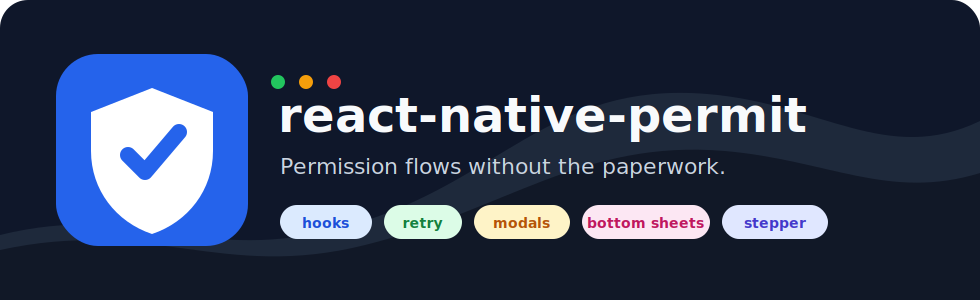
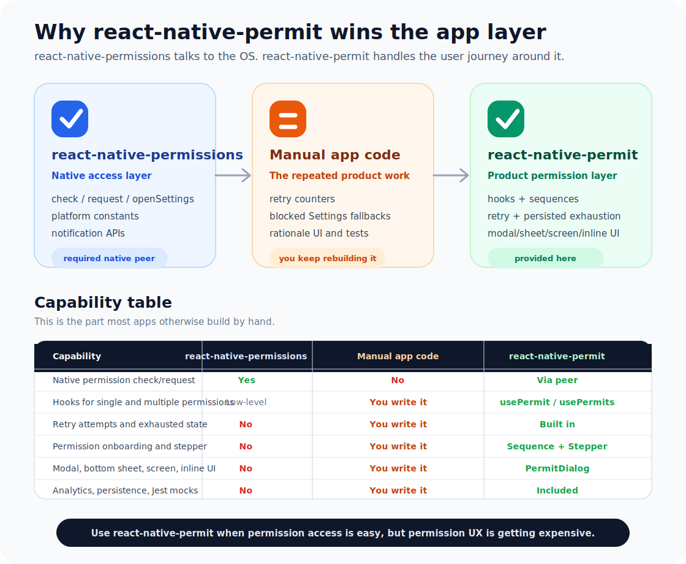
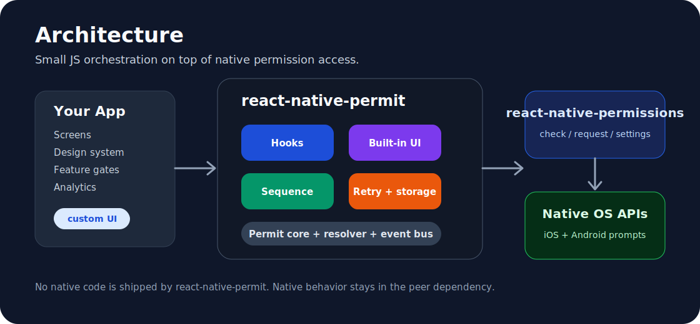
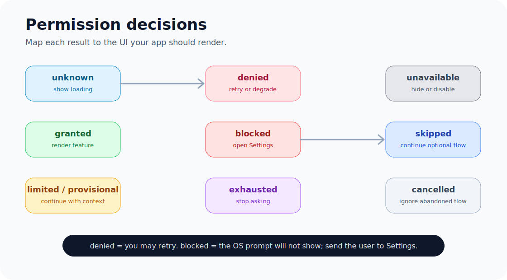
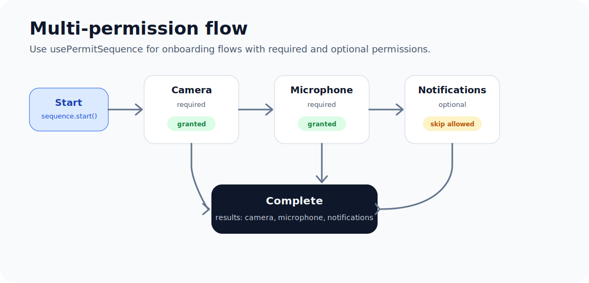
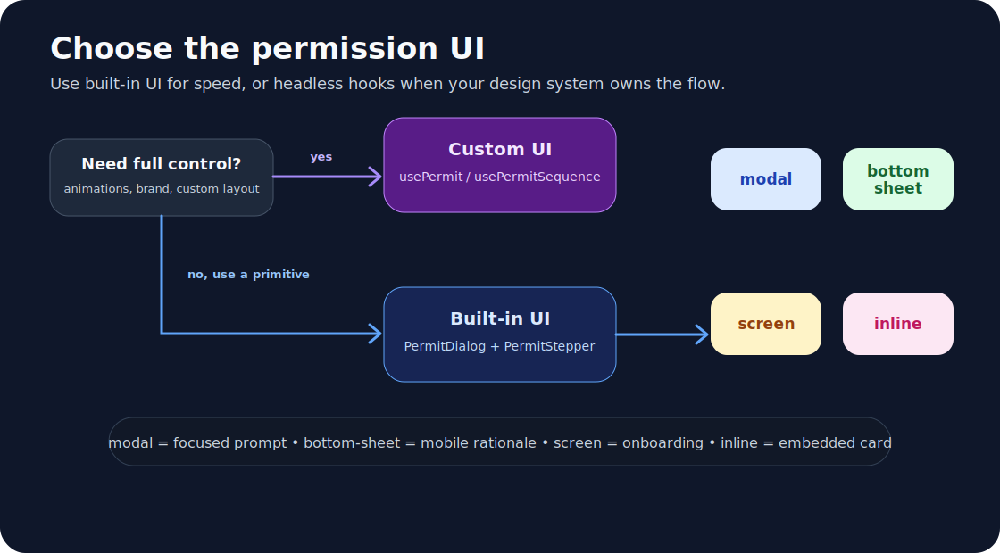

<p align="center">
  
</p>

<h1 align="center">react-native-permit</h1>

<p align="center">
  Permission hooks, retries, onboarding flows, modals, bottom sheets, screen UI,
  steppers, analytics, persistence, and Jest mocks for React Native.
</p>

[](https://www.npmjs.com/package/react-native-permit)
[](https://www.npmjs.com/package/react-native-permit)
[](./LICENSE)
[](https://www.typescriptlang.org/)
[](https://reactnative.dev/)
[](https://www.npmjs.com/package/react-native-permissions)
[](https://expo.dev/)
[](./docs/TESTING.md)

Small permission orchestration for React Native, built on top of
[`react-native-permissions`](https://www.npmjs.com/package/react-native-permissions).

> Permission prompts are tiny. Permission flows are not.

## Why

Raw permission libraries ask the OS for access. Production apps need the flow
around that prompt: rationale UI, retries, blocked-state handling, Settings
fallbacks, onboarding sequences, analytics, persistence, and tests.

`react-native-permit` keeps native permission access in `react-native-permissions`
and adds the app-level permission UX on top.

> The OS asks once. Your product has to explain, recover, retry, and remember.

<p align="center">
  
</p>

<p align="center">
  
</p>

## Features

| Feature | API |
| --- | --- |
| Check/request permissions | `Permit.check`, `Permit.request` |
| Single permission hook | `usePermit` |
| Multiple permission hook | `usePermits` |
| Status listener | `usePermitListener` |
| Multi-step onboarding | `usePermitSequence` |
| Built-in UI | `PermitDialog` |
| Stepper UI | `PermitStepper` |
| Retry/exhaustion | `retry` options |
| Analytics events | `Permit.configure({ onEvent })` |
| Jest mocks | `react-native-permit/testing` |

> Less permission plumbing. More feature shipping.

## Install

```bash
npm install react-native-permit react-native-permissions
```

For iOS, install pods after adding dependencies:

```bash
cd ios && pod install
```

Configure native permission declarations through `react-native-permissions`.
See [Platform setup](./docs/PLATFORM_SETUP.md).

## Quick Start

```tsx
import { Permit } from 'react-native-permit';

const result = await Permit.request('camera');

if (result === 'granted') {
  // Continue with the feature.
}
```

With retry and persisted exhaustion:

```tsx
await Permit.request('location', {
  retry: {
    maxAttempts: 3,
    persistExhaustion: true,
    resetExhaustionAfterDays: 30,
  },
});
```

## Hooks

```tsx
import { Button, Text, View } from 'react-native';
import { usePermit } from 'react-native-permit';

function CameraGate() {
  const camera = usePermit('camera');

  if (camera.status === 'unknown') return <Text>Checking...</Text>;
  if (camera.isGranted) return <Text>Camera is ready.</Text>;

  return (
    <View>
      <Text>Camera status: {camera.status}</Text>
      <Button title="Allow camera" onPress={() => camera.request()} />
      <Button title="Open settings" onPress={camera.openSettings} />
    </View>
  );
}
```

## Permission Decisions

<p align="center">
  
</p>

| Result | App action |
| --- | --- |
| `granted` | Render the feature |
| `limited` | Continue with limited photo access |
| `provisional` | Continue with quiet notification access |
| `denied` | Retry or degrade gracefully |
| `blocked` | Show a Settings fallback |
| `exhausted` | Stop asking until reset |
| `unavailable` | Hide or disable the feature |
| `cancelled` | Ignore abandoned flow |

## Custom Onboarding

Use `usePermitSequence` for fully custom multi-permission onboarding.

<p align="center">
  
</p>

```tsx
const sequence = usePermitSequence(
  [
    {
      permission: 'camera',
      rationale: {
        title: 'Scan items',
        message: 'Camera access lets you scan QR codes.',
      },
      retry: { maxAttempts: 2 },
    },
    {
      permission: 'notifications',
      optional: true,
      rationale: {
        title: 'Stay updated',
        message: 'Notifications tell you when work is done.',
      },
    },
  ],
  { onComplete: (results) => console.log(results) },
);
```

## Built-In UI

Use `PermitDialog` when you want small UI primitives without building every
permission surface yourself.

<p align="center">
  
</p>

```tsx
<PermitDialog
  presentation="bottom-sheet"
  visible={visible}
  title="Camera access"
  message="Camera access is used to scan QR codes."
  primaryLabel="Allow camera"
  secondaryLabel="Not now"
  onPrimary={() => Permit.request('camera')}
  onSecondary={() => setVisible(false)}
  onDismiss={() => setVisible(false)}
/>;
```

Supported presentations:

- `bottom-sheet`
- `modal`
- `screen`
- `inline`

> Bring your own UI, or borrow ours until design has opinions.

## Documentation

| Guide | Description |
| --- | --- |
| [Why this package](./docs/WHY_REACT_NATIVE_PERMIT.md) | Comparison diagram, use cases, props, and what you do not have to build |
| [API reference](./docs/API.md) | Full props, types, return values, and exports |
| [Recipes](./docs/RECIPES.md) | Camera gate, notifications, retry, custom onboarding, built-in UI |
| [Platform setup](./docs/PLATFORM_SETUP.md) | iOS plist and Android manifest examples |
| [Testing](./docs/TESTING.md) | `PermitMock` setup and examples |
| [Examples](./example/README.md) | Copy-paste examples and product flows |

## Supported Permissions

`camera`, `microphone`, `location`, `location-coarse`, `location-always`,
`notifications`, `photo-library`, `photo-library-add`, `contacts`, `calendar`,
`reminders`, `bluetooth`, `motion`, `face-id`, `tracking`, `speech-recognition`,
`body-sensors`, `activity-recognition`, `nearby-wifi-devices`, `media-location`.

See [API reference](./docs/API.md) for details.

## Package Size

The npm package ships only:

- `dist`
- `assets`
- `docs`
- `README.md`
- `LICENSE`
- `CHANGELOG.md`
- `package.json`

`src`, `example`, and `PACKAGE.md` are not published.

## Author

prakharcodehere

## License

MIT
